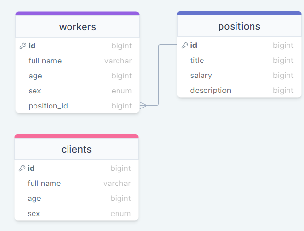

## Lab4
Варіант 1: Рекламне агенство

## docker-compose commands
Запуск
```
docker-compose --env-file .\configs\db.env  up
```
Зупинка і видалення контейнерів
```
docker-compose down 
```
## Application
Link: http://localhost


## endpoints

#### GET `/clients`

##### example req

`GET http://localhost:8080/clients`


res

Body
```json
[
    {
        "id": 3,
        "full_name": "Neiron",
        "age": 19,
        "sex": "male"
    },
    {
        "id": 2,
        "full_name": "Dantte",
        "age": 19,
        "sex": "male"
    }
]
```

#### GET `/clients/id`

##### example req

`GET http://localhost:8080/clients/2`

res

Body
```json
{
        "id": 2,
        "full_name": "Dantte",
        "age": 19,
        "sex": "male"
}
```

#### POST `/clients`

requires *full_name* (6-100 chrs), *age* (18-120), *sex* ('female','male')

##### example req

`POST http://localhost:8080/clients`

Body
```json
{
    "full_name":"Neiron",
    "age": 19,
    "sex": "male"
}
```
##### res

Body
```json
{
    "id": 3,
    "full_name": "Neiron",
    "age": 19,
    "sex": "male"
}
```
#### PUT `/clients/id`

##### example req

`PUT http://localhost:8080/clients/2`


Body
```json
{
    "full_name":"Dantte",
    "age": 19,
    "sex": "male"
}
```
##### res

Body
```json
{
    "id": 2,
    "full_name": "Dantte",
    "age": 19,
    "sex": "male"
}
```

#### DELETE `/clients/id`

##### example req

`DELETE http://localhost:8080/clients/2`

##### res

Body
```json
{
    "id": 2,
    "full_name": "Dantte",
    "age": 19,
    "sex": "male"
}
```

> Решта endpoint-ів аналогічна, тому наведу лише приклади `Body` для кожної структури

`workers`
Body
```json
{
    "full_name": "Dantte",
    "age": 19,
    "sex": "male",
    "position_id": 1 //fk to position(id)
}
```
`positions`
Body
```json
{
    "title": "example", //(6-100 chrs)
    "salary": 12500, //(>0)
    "description": "description" //(6-1000 chrs)
}
```
## Database ER diagram



    

